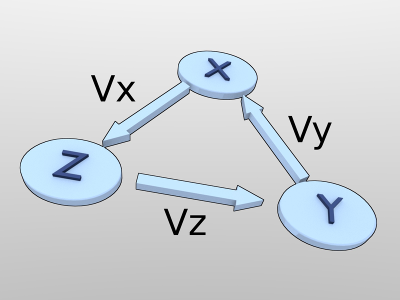
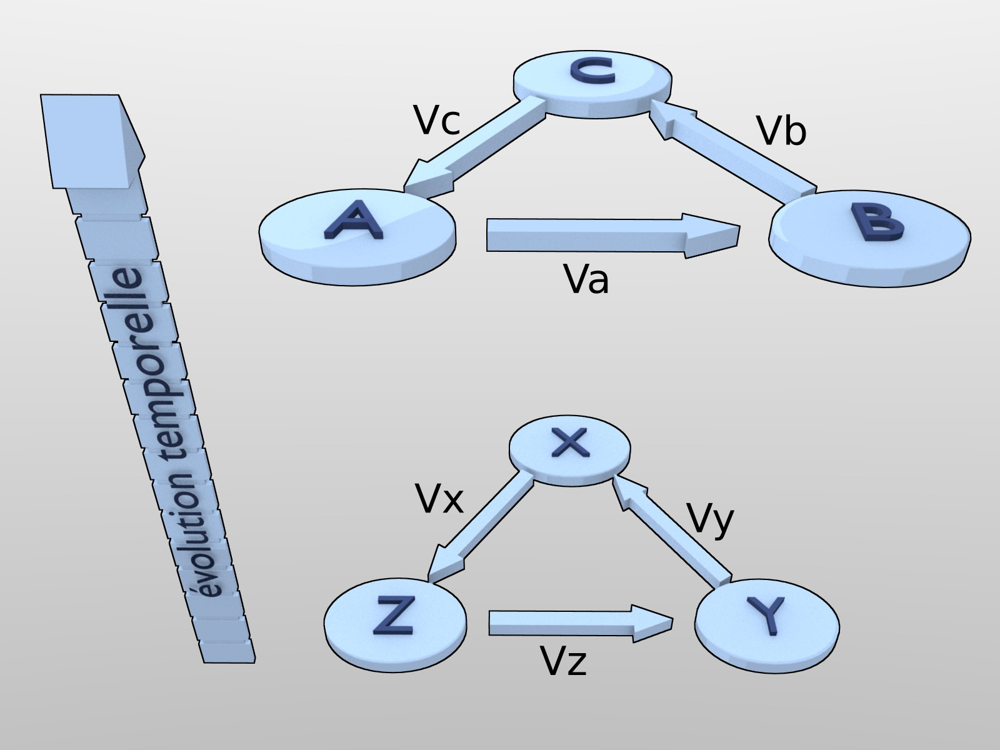

==============================
Problème des trois producteurs
==============================

La nécessité de définir une monnaie commune étant admise au sein de la
communauté des individus malgré leurs désaccords fondamentaux quant à ce qu'il
peuvent juger comme étant de la valeur ou pas, il reste un problème fondamental
de définition de cette monnaie. Il se réduit à la résolution du problème
spatio-temporel des trois producteurs que voici :

* X, Y, et Z, produisent respectivement des valeurs Vx Vy et Vz.  
* X souhaite obtenir Vy, Y souhaite obtenir Vz, et Z souhaite obtenir Vx.

On le voit immédiatement, les échanges ne peuvent pas se faire bilatéralement,
mais circulairement. Comme par ailleurs il est tout à fait possible que X
n'accorde aucune valeur à Vz, Y à Vx, et Z à Vy (principe de relativité), aucun
des biens ou services produits ne peut servir de mesure commune. C'est bien là
le point fondamental, qui implique que la monnaie devra être définie sur une
base indépendante des valeurs produites par chacun.

Le problème existe aussi dans le temps où, les individus, les productions, les
services et les besoins évolueront dans leur nature, et seront progressivement
amenés à disparaître ou à être remplacés. Il n'en devient pas moins nécessaire
d'avoir, à tout instant, la possibilité d'échanger de façon convenable la
production des uns et des autres, afin de satisfaire leurs besoins évolutifs
respectifs.

   
   Pour une petite unité de temps « dt » les individus X Y et Z co-existent, 
   produisent et échangent des valeurs stables.

Donc, non seulement « dans l'espace » (pour un temps d'évolution court « dt ») les
valeurs ne sont pas communément reconnues par les producteurs et font pourtant
l'objet d'échanges circulaires, mais « dans le temps » les individus et les
valeurs produites changent du tout au tout.

Il n'en reste pas moins, que pour un temps suffisamment court, on constate une
certaine stabilité. Il y a donc une évolution continue des paramètres
économiques, dont la monnaie que nous voulons définir, qui permet aux
producteurs présents à tout instant, et au moins pour ce temps court, de
s'accorder sur la stabilité de leur outil d'échange circulaire.

Aussi comme nous le allons le démontrer dans ce qui suit, et pour être cohérent
avec nos fondements, seule une quantification purement mathématique des
échanges, indépendante de tout bien ou service de référence est acceptable par
les acteurs du problème des trois producteurs.

Ce résultat n'enlève en rien de la valeur à la monnaie, puisque quoique purement
mathématique, sa quantité totale est limitée à tout instant. Le potentiel
d'achat qu'elle recèle demeurera donc limité par les prix au delà desquels les
producteurs ne pourraient pas échanger leurs productions par manque de monnaie.

   Le problème des trois producteurs se complique lorsqu'au bout d'un temps suffisamment long ils sont morts et remplacés

Le problème est posé, nous allons maintenant balayer les solutions envisagées et
les soucis qu'elles posent avant d'aborder la solution relativiste proprement
dite.
